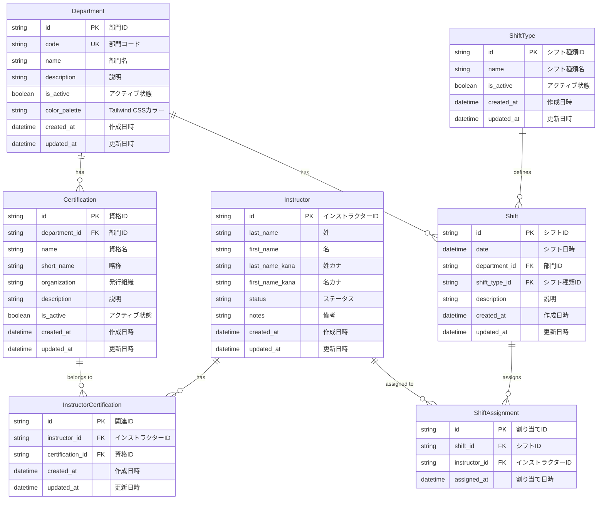

# データベース設計書

## システム概要

スキー・スノーボードスクールのシフト管理システムのデータベース設計書です。  
OpenAPI 仕様書（docs/api/openapi.yaml）に基づいて設計されています。

## 技術仕様

- **データベース**: Cloudflare D1 (SQLite)
- **ORM**: Prisma 6.12
- **識別子**: cuid()による UUID 生成

## エンティティ関係図（ER 図）



### 関係性の説明

- **Department → Certification**: 1 対多（1 部門に複数資格）
- **Department → Shift**: 1 対多（1 部門に複数シフト）
- **Instructor ↔ Certification**: 多対多（中間テーブル：InstructorCertification）
- **Instructor ↔ Shift**: 多対多（中間テーブル：ShiftAssignment）
- **ShiftType → Shift**: 1 対多（1 シフト種類に複数シフト）

## テーブル定義

### 1. Department（部門）テーブル

スキー・スノーボード等の部門を管理するマスタテーブル。  
`color_palette`フィールドには Tailwind CSS のカラーパレット名を格納し、UI での色分け表示に使用します。

**色の使用例:**

- スキー部門: `"blue"` → `bg-blue-500`, `text-blue-700`, `border-blue-300` など
- スノーボード部門: `"emerald"` → `bg-emerald-500`, `text-emerald-700`, `border-emerald-300` など

| カラム名      | データ型     | 制約                        | 説明                                                                    |
| ------------- | ------------ | --------------------------- | ----------------------------------------------------------------------- |
| id            | VARCHAR(25)  | PRIMARY KEY                 | 部門 ID                                                                 |
| code          | VARCHAR(20)  | UNIQUE NOT NULL             | 部門コード（例: "ski", "snowboard"）                                    |
| name          | VARCHAR(100) | NOT NULL                    | 部門名（例: "スキー", "スノーボード"）                                  |
| description   | TEXT         |                             | 説明・備考                                                              |
| is_active     | BOOLEAN      | DEFAULT TRUE                | アクティブ状態                                                          |
| color_palette | VARCHAR(20)  | NOT NULL                    | Tailwind CSS カラーパレット名（例: "blue", "emerald", "red", "orange"） |
| created_at    | DATETIME     | DEFAULT CURRENT_TIMESTAMP   | 作成日時                                                                |
| updated_at    | DATETIME     | ON UPDATE CURRENT_TIMESTAMP | 更新日時                                                                |

**インデックス:**

- PRIMARY KEY (id)
- UNIQUE INDEX idx_departments_code (code)
- INDEX idx_departments_active (is_active)

### 2. Certification（資格）テーブル

インストラクター資格を管理するマスタテーブル。

| カラム名      | データ型     | 制約                        | 説明                      |
| ------------- | ------------ | --------------------------- | ------------------------- |
| id            | VARCHAR(25)  | PRIMARY KEY                 | 資格 ID                   |
| department_id | VARCHAR(25)  | NOT NULL                    | 部門 ID（FK）             |
| name          | VARCHAR(200) | NOT NULL                    | 資格名                    |
| short_name    | VARCHAR(50)  |                             | 略称                      |
| organization  | VARCHAR(100) | NOT NULL                    | 発行組織（例: SAJ, JSBA） |
| description   | TEXT         |                             | 説明・備考                |
| is_active     | BOOLEAN      | DEFAULT TRUE                | アクティブ状態            |
| created_at    | DATETIME     | DEFAULT CURRENT_TIMESTAMP   | 作成日時                  |
| updated_at    | DATETIME     | ON UPDATE CURRENT_TIMESTAMP | 更新日時                  |

**外部キー制約:**

- FOREIGN KEY (department_id) REFERENCES departments(id)

**インデックス:**

- PRIMARY KEY (id)
- INDEX idx_certifications_department_id (department_id)
- INDEX idx_certifications_active (is_active)
- INDEX idx_certifications_organization (organization)

### 3. Instructor（インストラクター）テーブル

インストラクターの基本情報を管理するテーブル。

| カラム名        | データ型    | 制約                        | 説明                                    |
| --------------- | ----------- | --------------------------- | --------------------------------------- |
| id              | VARCHAR(25) | PRIMARY KEY                 | インストラクター ID                     |
| last_name       | VARCHAR(50) | NOT NULL                    | 姓                                      |
| first_name      | VARCHAR(50) | NOT NULL                    | 名                                      |
| last_name_kana  | VARCHAR(50) |                             | 姓（カナ）                              |
| first_name_kana | VARCHAR(50) |                             | 名（カナ）                              |
| status          | VARCHAR(20) | DEFAULT 'ACTIVE'            | ステータス（ACTIVE, INACTIVE, RETIRED） |
| notes           | TEXT        |                             | 備考                                    |
| created_at      | DATETIME    | DEFAULT CURRENT_TIMESTAMP   | 作成日時                                |
| updated_at      | DATETIME    | ON UPDATE CURRENT_TIMESTAMP | 更新日時                                |

**チェック制約:**

- CHECK (status IN ('ACTIVE', 'INACTIVE', 'RETIRED'))

**インデックス:**

- PRIMARY KEY (id)
- INDEX idx_instructors_status (status)
- INDEX idx_instructors_name (last_name, first_name)
- INDEX idx_instructors_kana (last_name_kana, first_name_kana)

### 4. InstructorCertification（インストラクター資格関連）テーブル

インストラクターと資格の多対多関係を管理する中間テーブル。

| カラム名         | データ型    | 制約                        | 説明                      |
| ---------------- | ----------- | --------------------------- | ------------------------- |
| id               | VARCHAR(25) | PRIMARY KEY                 | 関連 ID                   |
| instructor_id    | VARCHAR(25) | NOT NULL                    | インストラクター ID（FK） |
| certification_id | VARCHAR(25) | NOT NULL                    | 資格 ID（FK）             |
| created_at       | DATETIME    | DEFAULT CURRENT_TIMESTAMP   | 作成日時                  |
| updated_at       | DATETIME    | ON UPDATE CURRENT_TIMESTAMP | 更新日時                  |

**外部キー制約:**

- FOREIGN KEY (instructor_id) REFERENCES instructors(id) ON DELETE CASCADE
- FOREIGN KEY (certification_id) REFERENCES certifications(id) ON DELETE CASCADE

**ユニーク制約:**

- UNIQUE (instructor_id, certification_id)

**インデックス:**

- PRIMARY KEY (id)
- UNIQUE INDEX idx_instructor_cert_unique (instructor_id, certification_id)
- INDEX idx_instructor_cert_instructor_id (instructor_id)
- INDEX idx_instructor_cert_certification_id (certification_id)

### 5. ShiftType（シフト種類）テーブル

シフトの種類を管理するマスタテーブル。

| カラム名   | データ型     | 制約                        | 説明                                         |
| ---------- | ------------ | --------------------------- | -------------------------------------------- |
| id         | VARCHAR(25)  | PRIMARY KEY                 | シフト種類 ID                                |
| name       | VARCHAR(100) | NOT NULL                    | シフト種類名（例: "レッスン", "パトロール"） |
| is_active  | BOOLEAN      | DEFAULT TRUE                | アクティブ状態                               |
| created_at | DATETIME     | DEFAULT CURRENT_TIMESTAMP   | 作成日時                                     |
| updated_at | DATETIME     | ON UPDATE CURRENT_TIMESTAMP | 更新日時                                     |

**インデックス:**

- PRIMARY KEY (id)
- INDEX idx_shift_types_active (is_active)

### 6. Shift（シフト）テーブル

シフト枠を管理するテーブル。

| カラム名       | データ型    | 制約                        | 説明                |
| -------------- | ----------- | --------------------------- | ------------------- |
| id             | VARCHAR(25) | PRIMARY KEY                 | シフト ID           |
| date           | DATETIME    | NOT NULL                    | シフト日時          |
| department_id  | VARCHAR(25) | NOT NULL                    | 部門 ID（FK）       |
| shift_type_id  | VARCHAR(25) | NOT NULL                    | シフト種類 ID（FK） |
| description    | TEXT        |                             | 説明・備考          |
| created_at     | DATETIME    | DEFAULT CURRENT_TIMESTAMP   | 作成日時            |
| updated_at     | DATETIME    | ON UPDATE CURRENT_TIMESTAMP | 更新日時            |

**外部キー制約:**

- FOREIGN KEY (department_id) REFERENCES departments(id)
- FOREIGN KEY (shift_type_id) REFERENCES shift_types(id)


**インデックス:**

- PRIMARY KEY (id)
- INDEX idx_shifts_department_id (department_id)
- INDEX idx_shifts_shift_type_id (shift_type_id)
- INDEX idx_shifts_date (date)
- INDEX idx_shifts_date_department (date, department_id)
- INDEX idx_shifts_department_type_date (department_id, shift_type_id, date)

### 7. ShiftAssignment（シフト割り当て）テーブル

シフトとインストラクターの多対多関係を管理する中間テーブル。

| カラム名      | データ型    | 制約                      | 説明                      |
| ------------- | ----------- | ------------------------- | ------------------------- |
| id            | VARCHAR(25) | PRIMARY KEY               | 割り当て ID               |
| shift_id      | VARCHAR(25) | NOT NULL                  | シフト ID（FK）           |
| instructor_id | VARCHAR(25) | NOT NULL                  | インストラクター ID（FK） |
| assigned_at   | DATETIME    | DEFAULT CURRENT_TIMESTAMP | 割り当て日時              |

**外部キー制約:**

- FOREIGN KEY (shift_id) REFERENCES shifts(id) ON DELETE CASCADE
- FOREIGN KEY (instructor_id) REFERENCES instructors(id) ON DELETE CASCADE

**ユニーク制約:**

- UNIQUE (shift_id, instructor_id)

**インデックス:**

- PRIMARY KEY (id)
- UNIQUE INDEX idx_shift_assignment_unique (shift_id, instructor_id)
- INDEX idx_shift_assignments_shift_id (shift_id)
- INDEX idx_shift_assignments_instructor_id (instructor_id)
- INDEX idx_shift_assignments_assigned_at (assigned_at)


## パフォーマンス設計

### 高頻度アクセスパターンとインデックス戦略

#### 1. シフト検索の最適化

**主要なクエリパターン:**
- 日付範囲でのシフト一覧取得
- 部門別・シフト種類別のフィルタリング
- シフト割り当て状況の確認

**最適化されたインデックス:**
```sql
-- 基本インデックス（テーブル定義で既に定義済み）
-- - idx_shifts_date (date)
-- - idx_shifts_date_department (date, department_id)
-- - idx_shifts_department_type_date (department_id, shift_type_id, date)

-- 追加の最適化インデックス
CREATE INDEX idx_shifts_date_type ON shifts(date, shift_type_id);

-- SQLite用カバリングインデックス（INCLUDE句の代替）
CREATE INDEX idx_shifts_covering ON shifts(date, department_id, shift_type_id, id, description);
```

#### 2. インストラクター検索の最適化

**主要なクエリパターン:**
- 名前検索（ひらがな・カタカナ・漢字）
- ステータス別フィルタリング
- 資格保有者検索

**最適化されたインデックス:**
```sql
-- 基本インデックス（テーブル定義で既に定義済み）
-- - idx_instructors_name (last_name, first_name)
-- - idx_instructors_kana (last_name_kana, first_name_kana)
-- - idx_instructors_status (status)

-- 複合検索用の追加インデックス
CREATE INDEX idx_instructors_status_name ON instructors(status, last_name, first_name);
CREATE INDEX idx_instructors_status_kana ON instructors(status, last_name_kana, first_name_kana);

-- 条件付きインデックス（アクティブなインストラクターのみ）
CREATE INDEX idx_instructors_active_name ON instructors(last_name, first_name) WHERE status = 'ACTIVE';
```

#### 3. シフト割り当て検索の最適化

**主要なクエリパターン:**
- インストラクター別のシフト履歴
- シフト別の割り当て一覧
- 期間指定での割り当て統計

**最適化されたインデックス:**
```sql
-- 基本インデックス（テーブル定義で既に定義済み）
-- - idx_shift_assignments_shift_id (shift_id)
-- - idx_shift_assignments_instructor_id (instructor_id)
-- - idx_shift_assignments_assigned_at (assigned_at)
-- - idx_shift_assignment_unique (shift_id, instructor_id) [UNIQUE]

-- 複合検索用の追加インデックス
CREATE INDEX idx_assignments_instructor_date ON shift_assignments(instructor_id, assigned_at);
CREATE INDEX idx_assignments_date_instructor ON shift_assignments(assigned_at, instructor_id);

-- SQLite用カバリングインデックス
CREATE INDEX idx_assignments_shift_covering ON shift_assignments(shift_id, instructor_id, assigned_at);
```

### クエリ最適化指針

#### 効率的なJOIN戦略

1. **シフト一覧の取得（関連データ込み）**
   ```sql
   -- 最適化されたクエリ例
   SELECT s.*, d.name as department_name, st.name as shift_type_name,
          COUNT(sa.id) as assigned_count
   FROM shifts s
   JOIN departments d ON s.department_id = d.id
   JOIN shift_types st ON s.shift_type_id = st.id
   LEFT JOIN shift_assignments sa ON s.id = sa.shift_id
   WHERE s.date BETWEEN ? AND ?
     AND d.is_active = true
   GROUP BY s.id
   ORDER BY s.date, d.name;
   ```

2. **インストラクター検索（資格情報込み）**
   ```sql
   -- 資格保有者の効率的な検索
   SELECT DISTINCT i.*
   FROM instructors i
   JOIN instructor_certifications ic ON i.id = ic.instructor_id
   JOIN certifications c ON ic.certification_id = c.id
   WHERE i.status = 'ACTIVE'
     AND c.department_id = ?
     AND c.is_active = true;
   ```

### SQLite固有の最適化

#### Cloudflare D1での最適化ポイント

1. **PRAGMA設定の活用**
   ```sql
   PRAGMA journal_mode = WAL;
   PRAGMA synchronous = NORMAL;
   PRAGMA cache_size = 10000;
   PRAGMA temp_store = MEMORY;
   ```

2. **効率的なページング**
   ```sql
   -- カーソルベースページング（OFFSET避ける）
   SELECT * FROM shifts 
   WHERE date >= ?
   ORDER BY date, id
   LIMIT 20;
   ```

3. **統計クエリの最適化**
   ```sql
   -- インデックスを活用した高速集計
   SELECT department_id, COUNT(*) as shift_count
   FROM shifts
   WHERE date >= date('now', 'start of month')
   GROUP BY department_id;
   ```


## データ整合性

### 外部キー制約による参照整合性

- すべての外部キー関係に適切な制約を設定
- 中間テーブルには `ON DELETE CASCADE` を設定
- マスタテーブルには削除制限を設定

### チェック制約によるデータ検証

- インストラクターのステータス値の制限（ACTIVE, INACTIVE, RETIRED）

### ユニーク制約による重複防止

- 部門コードの一意性
- インストラクター・資格関連の重複防止
- シフト割り当ての重複防止


## API 仕様との対応表

| API エンティティ        | テーブル名                | 主な対応フィールド                                 |
| ----------------------- | ------------------------- | -------------------------------------------------- |
| Department              | departments               | id, code, name, description, isActive, colorPalette |
| Certification           | certifications            | id, departmentId, name, shortName, organization    |
| Instructor              | instructors               | id, lastName, firstName, status, notes             |
| InstructorCertification | instructor_certifications | id, instructorId, certificationId                  |
| ShiftType               | shift_types               | id, name, isActive                                 |
| Shift                   | shifts                    | id, date, departmentId, shiftTypeId, description   |
| ShiftAssignment         | shift_assignments         | id, shiftId, instructorId, assignedAt              |

---

**最終更新日**: 2025-07-21  
**バージョン**: 1.0.0
