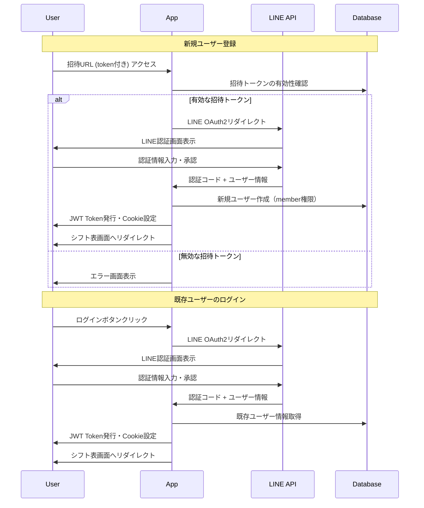
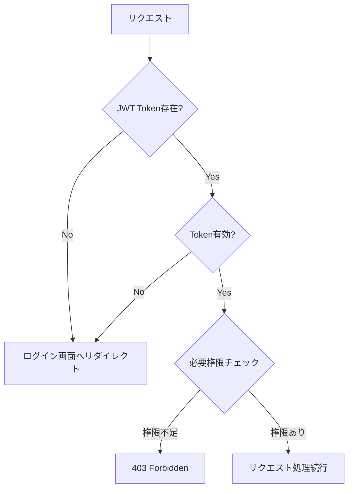

# 認証システム設計書

## 1. 概要

スキー・スノーボードスクールのシフト管理システムにLINE認証ベースの権限管理機能を追加する。
内部スタッフ（約50名）のみがアクセス可能な招待制システムを構築し、管理者・マネージャー・メンバーの3段階の権限制御を実現する。

### 1.1 設計方針

- **セッションレス認証**: JWT Token（48時間有効）によるステートレス認証
- **招待制システム**: 招待URL経由でのみ新規登録可能
- **シンプル運用**: 高齢者を含むユーザー層を考慮した操作性重視
- **Cloudflare対応**: Workers + D1環境での動作保証

## 2. 認証フロー

### 2.1 基本認証フロー



### 2.2 権限チェックフロー



## 3. 権限体系

### 3.1 権限レベル

| 権限        | 説明           | アクセス可能機能                       |
| ----------- | -------------- | -------------------------------------- |
| **admin**   | システム管理者 | 全機能 + ユーザー管理 + 招待URL管理    |
| **manager** | 現場管理者     | 既存管理機能（シフト管理、マスタ管理） |
| **member**  | 一般スタッフ   | シフト表閲覧のみ                       |

### 3.2 機能別権限マトリクス

| 機能                 | member | manager | admin |
| -------------------- | ------ | ------- | ----- |
| シフト表閲覧         | ✅     | ✅      | ✅    |
| シフト作成・編集     | ❌     | ✅      | ✅    |
| インストラクター管理 | ❌     | ✅      | ✅    |
| 資格・シフト種別管理 | ❌     | ✅      | ✅    |
| 招待URL管理          | ❌     | ❌      | ✅    |
| ユーザー権限管理     | ❌     | ❌      | ✅    |

## 4. データ構造

### 4.1 ユーザーテーブル (users)

```sql
CREATE TABLE users (
  id TEXT PRIMARY KEY,                  -- UUID
  line_user_id TEXT UNIQUE NOT NULL,   -- LINE固有ユーザーID
  display_name TEXT NOT NULL,          -- LINE表示名
  role TEXT NOT NULL DEFAULT 'member', -- 権限: admin/manager/member
  is_active BOOLEAN DEFAULT true,      -- アクティブ状態
  created_at DATETIME DEFAULT CURRENT_TIMESTAMP,
  updated_at DATETIME DEFAULT CURRENT_TIMESTAMP
);
```

### 4.2 招待トークンテーブル (invitation_tokens)

```sql
CREATE TABLE invitation_tokens (
  token TEXT PRIMARY KEY,              -- 招待トークン（UUID）
  expires_at DATETIME NOT NULL,        -- 有効期限
  is_active BOOLEAN DEFAULT true,      -- アクティブ状態
  created_by TEXT NOT NULL,            -- 作成者（管理者ID）
  max_uses INTEGER,                    -- 最大使用回数（NULL=無制限）
  used_count INTEGER DEFAULT 0,       -- 現在の使用回数
  created_at DATETIME DEFAULT CURRENT_TIMESTAMP,
  FOREIGN KEY (created_by) REFERENCES users(id)
);
```

### 4.3 JWT Payload構造

```typescript
interface JWTPayload {
  sub: string; // ユーザーID
  line_user_id: string; // LINE User ID
  role: 'admin' | 'manager' | 'member';
  name: string; // 表示名
  iat: number; // 発行時刻（Unix timestamp）
  exp: number; // 有効期限（Unix timestamp、48時間後）
}
```

## 5. 招待システム

### 5.1 招待URL生成

```typescript
// 招待URL形式
//your-domain.com/auth/invite/[TOKEN]

// トークン生成ロジック
https: const generateInviteToken = async (adminUserId: string, expiresInHours: number = 168) => {
  const token = crypto.randomUUID();
  const expiresAt = new Date(Date.now() + expiresInHours * 60 * 60 * 1000);

  // 前のトークンを無効化（単一アクティブ制御）
  await deactivatePreviousTokens(adminUserId);

  // 新規トークン作成
  await db.invitation_tokens.create({
    token,
    expires_at: expiresAt,
    created_by: adminUserId,
    is_active: true,
  });

  return `https://your-domain.com/auth/invite/${token}`;
};
```

### 5.2 招待トークン管理

- **デフォルト有効期限**: 1週間（168時間）
- **最大有効期限**: 1ヶ月（720時間）
- **単一アクティブ制御**: 新規発行時に前のトークンを自動無効化
- **手動無効化**: 管理者による緊急停止機能

## 6. セキュリティ対策

### 6.1 JWT セキュリティ

- **有効期限**: 48時間（ユーザビリティとセキュリティのバランス）
- **署名アルゴリズム**: HS256 (HMAC with SHA-256)
- **Cookie設定**: HttpOnly, Secure, SameSite=Strict
- **秘密鍵**: 環境変数で管理（256bit以上）

### 6.2 招待システムセキュリティ

- **トークンの一意性**: UUID v4使用
- **有効期限制御**: 期限切れトークンの自動無効化
- **レート制限**: 同一IPからの連続アクセス制限（実装時検討）

### 6.3 LINE OAuth2 セキュリティ

- **state パラメータ**: CSRFリクエストフォージェリ対策
- **nonce パラメータ**: Replay Attack対策
- **適切なScope設定**: profile, openid のみ

## 7. エラーハンドリング

### 7.1 認証エラー

| エラータイプ     | HTTPステータス | 処理                     |
| ---------------- | -------------- | ------------------------ |
| JWT無効/期限切れ | 401            | ログイン画面リダイレクト |
| 権限不足         | 403            | 権限不足エラー画面       |
| 招待トークン無効 | 400            | 招待無効エラー画面       |
| LINE認証失敗     | 401            | 認証失敗エラー画面       |

### 7.2 ログ出力

```typescript
// 認証関連ログ項目
interface AuthLog {
  timestamp: string;
  event: 'login' | 'logout' | 'token_expired' | 'permission_denied' | 'invite_used';
  user_id?: string;
  line_user_id?: string;
  ip_address: string;
  user_agent: string;
  additional_info?: Record<string, any>;
}
```

## 8. パフォーマンス最適化

### 8.1 JWT検証最適化

- **In-Memory Cache**: JWT署名検証結果の一時キャッシュ
- **非同期検証**: 並列処理可能な箇所での非同期JWT検証

### 8.2 データベースアクセス最適化

- **Connection Pooling**: Prisma Connection Pool活用
- **インデックス設計**: ユーザーID、LINE User IDにインデックス
- **クエリ最適化**: 必要な列のみSELECT

## 9. 運用フロー

### 9.1 初期セットアップ

1. **ファーストアドミン作成**: 環境変数による初期管理者設定
2. **LINE Developers設定**: Channel作成、Callback URL設定
3. **環境変数設定**: JWT秘密鍵、LINE認証情報

### 9.2 日常運用

1. **新規スタッフ追加**: 管理者が招待URL生成・共有
2. **権限変更**: 管理者がユーザー権限を手動変更
3. **緊急アクセス停止**: 招待トークン無効化、ユーザー無効化

### 9.3 シーズン運用

- **シーズン開始前**: 新規招待URL生成・配布
- **シーズン中**: 必要に応じて追加招待URL発行
- **シーズン終了後**: 全招待トークン無効化

## 10. 開発・テスト戦略

### 10.1 環境分離

```bash
# 開発環境
DATABASE_URL="file:./dev.db"
LINE_CHANNEL_ID="dev_channel_id"
NEXTAUTH_URL="http://localhost:3000"

# 本番環境
DATABASE_URL="cloudflare_d1_url"
LINE_CHANNEL_ID="prod_channel_id"
NEXTAUTH_URL="https://your-app.pages.dev"
```

### 10.2 テスト項目

- **Unit Tests**: JWT生成・検証、権限チェックロジック
- **Integration Tests**: LINE認証フロー、招待システム
- **E2E Tests**: 全体の認証フロー（ブラウザ自動化）

## 11. 今後の拡張性

### 11.1 将来的な機能追加

- **2要素認証**: LINE + SMS/Email認証
- **セッション管理**: アクティブセッション一覧・強制ログアウト
- **監査ログ**: 詳細なアクティビティログ

### 11.2 スケーラビリティ

- **複数組織対応**: テナント機能追加
- **役職細分化**: より詳細な権限レベル
- **API認証**: 外部システム連携用のAPI Key認証

---

## 付録

### A. 環境変数一覧

```bash
# 必須環境変数
LINE_CHANNEL_ID=             # LINE Login Channel ID
LINE_CHANNEL_SECRET=         # LINE Login Channel Secret
JWT_SECRET=                  # JWT署名用秘密鍵（256bit以上）
DATABASE_URL=                # データベース接続URL
NEXTAUTH_URL=                # アプリケーションのベースURL

# オプション環境変数
JWT_EXPIRES_IN=48h           # JWT有効期限（デフォルト: 48h）
INVITE_DEFAULT_EXPIRES=168h  # 招待トークンデフォルト有効期限（デフォルト: 168h）
```

### B. セットアップチェックリスト

- [ ] LINE Developers でChannel作成
- [ ] Callback URL設定（開発・本番）
- [ ] 環境変数設定
- [ ] データベースマイグレーション実行
- [ ] ファーストアドミン作成
- [ ] 初回招待URL生成・テスト
- [ ] 本番デプロイ・動作確認
