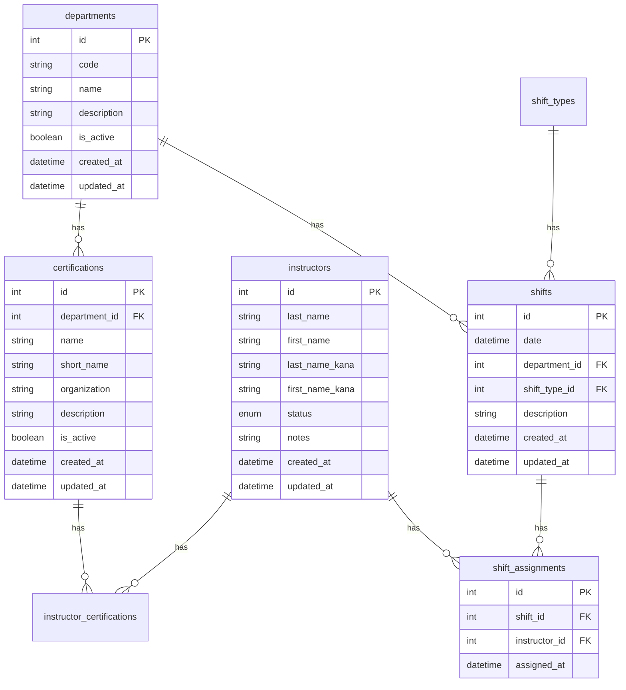
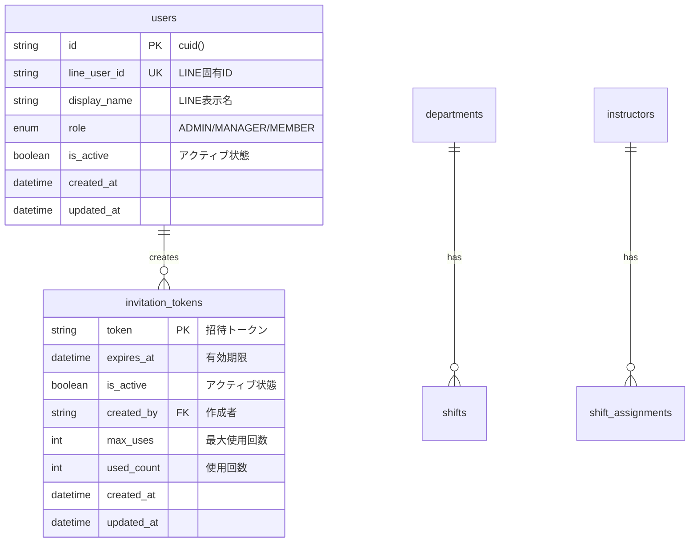

# データベース設計書 - 認証システム拡張

## 1. 概要

既存のスキー・スノーボードスクールシフト管理システムのPrismaスキーマに、LINE認証ベースの認証・権限管理機能を追加するためのデータベース設計書。

### 1.1 設計方針

- **既存データ影響なし**: 現行システムとの互換性維持
- **Prisma ORM活用**: 型安全なデータベース操作
- **SQLite/D1対応**: 開発・本番環境での動作保証
- **論理削除**: データ保全のための論理削除パターン

## 2. 既存スキーマ概要

### 2.1 現在のER図



## 3. 認証システム拡張スキーマ

### 3.1 新規テーブル定義

#### 3.1.1 ユーザーテーブル (users)

```prisma
/// ユーザー認証・権限管理テーブル
model User {
  id           String   @id @default(cuid())
  lineUserId   String   @unique @map("line_user_id")
  displayName  String   @map("display_name")
  role         UserRole @default(MEMBER)
  isActive     Boolean  @default(true) @map("is_active")
  createdAt    DateTime @default(now()) @map("created_at")
  updatedAt    DateTime @updatedAt @map("updated_at")

  // リレーション
  createdInvitations InvitationToken[] @relation("CreatedBy")

  @@index([lineUserId], map: "idx_users_line_user_id")
  @@index([role], map: "idx_users_role")
  @@index([isActive], map: "idx_users_active")
  @@index([role, isActive], map: "idx_users_role_active")
  @@map("users")
}

/// ユーザー権限列挙型
enum UserRole {
  ADMIN
  MANAGER
  MEMBER
}
```

**テーブル仕様**:

| カラム       | 型       | 制約             | 説明               |
| ------------ | -------- | ---------------- | ------------------ |
| id           | String   | PK, CUID         | ユーザー識別子     |
| line_user_id | String   | UNIQUE, NOT NULL | LINE固有ユーザーID |
| display_name | String   | NOT NULL         | LINE表示名         |
| role         | Enum     | DEFAULT MEMBER   | 権限レベル         |
| is_active    | Boolean  | DEFAULT true     | アクティブ状態     |
| created_at   | DateTime | DEFAULT now()    | 作成日時           |
| updated_at   | DateTime | AUTO UPDATE      | 更新日時           |

#### 3.1.2 招待トークンテーブル (invitation_tokens)

```prisma
/// 招待URL管理テーブル
model InvitationToken {
  token     String   @id
  expiresAt DateTime @map("expires_at")
  isActive  Boolean  @default(true) @map("is_active")
  createdBy String   @map("created_by")
  maxUses   Int?     @map("max_uses")
  usedCount Int      @default(0) @map("used_count")
  createdAt DateTime @default(now()) @map("created_at")
  updatedAt DateTime @updatedAt @map("updated_at")

  // リレーション
  creator User @relation("CreatedBy", fields: [createdBy], references: [id])

  @@index([expiresAt], map: "idx_invitation_tokens_expires_at")
  @@index([isActive], map: "idx_invitation_tokens_active")
  @@index([createdBy], map: "idx_invitation_tokens_created_by")
  @@index([isActive, expiresAt], map: "idx_invitation_tokens_active_expires")
  @@map("invitation_tokens")
}
```

**テーブル仕様**:

| カラム     | 型       | 制約           | 説明                 |
| ---------- | -------- | -------------- | -------------------- |
| token      | String   | PK             | 招待トークン（UUID） |
| expires_at | DateTime | NOT NULL       | 有効期限             |
| is_active  | Boolean  | DEFAULT true   | アクティブ状態       |
| created_by | String   | FK → users(id) | 作成者ID             |
| max_uses   | Int      | NULL可         | 最大使用回数         |
| used_count | Int      | DEFAULT 0      | 現在の使用回数       |
| created_at | DateTime | DEFAULT now()  | 作成日時             |
| updated_at | DateTime | AUTO UPDATE    | 更新日時             |

### 3.2 拡張ER図



## 4. インデックス戦略

### 4.1 users テーブル

```sql
-- パフォーマンス最適化インデックス
CREATE INDEX idx_users_line_user_id ON users(line_user_id);        -- LINE認証検索
CREATE INDEX idx_users_role ON users(role);                        -- 権限フィルタ
CREATE INDEX idx_users_active ON users(is_active);                 -- アクティブユーザー
CREATE INDEX idx_users_role_active ON users(role, is_active);      -- 複合条件検索
```

### 4.2 invitation_tokens テーブル

```sql
-- パフォーマンス最適化インデックス
CREATE INDEX idx_invitation_tokens_expires_at ON invitation_tokens(expires_at);
CREATE INDEX idx_invitation_tokens_active ON invitation_tokens(is_active);
CREATE INDEX idx_invitation_tokens_created_by ON invitation_tokens(created_by);
CREATE INDEX idx_invitation_tokens_active_expires ON invitation_tokens(is_active, expires_at);
```

## 5. データ整合性制約

### 5.1 制約定義

```prisma
// users テーブル制約
model User {
  // LINE User ID は一意でなければならない
  lineUserId String @unique @map("line_user_id")

  // 表示名は空文字列不可
  displayName String @map("display_name")

  // 権限はENUMで制限
  role UserRole @default(MEMBER)
}

// invitation_tokens テーブル制約
model InvitationToken {
  // トークンは主キー（一意性保証）
  token String @id

  // 有効期限は必須
  expiresAt DateTime @map("expires_at")

  // 作成者は存在するユーザーを参照
  creator User @relation("CreatedBy", fields: [createdBy], references: [id])
}
```

### 5.2 ビジネスルール制約

```typescript
// アプリケーションレベルでの制約
interface UserValidation {
  // LINE User ID は 'U' で始まる文字列
  lineUserId: string; // Pattern: /^U[0-9a-f]{32}$/

  // 表示名は1文字以上50文字以下
  displayName: string; // Length: 1-50

  // 権限は定義された値のみ
  role: 'ADMIN' | 'MANAGER' | 'MEMBER';
}

interface InvitationTokenValidation {
  // トークンはUUID形式
  token: string; // UUID v4

  // 有効期限は現在時刻より未来
  expiresAt: Date; // > new Date()

  // 最大使用回数は正の整数
  maxUses?: number; // > 0 or null
}
```

## 6. マイグレーション戦略

### 6.1 マイグレーションファイル構成

```
prisma/migrations/
├── 20250829000001_add_authentication_system/
│   └── migration.sql
└── migration_lock.toml
```

### 6.2 マイグレーション SQL

```sql
-- 認証システム追加マイグレーション
-- Generated: 2024-08-29T10:00:00.000Z

-- CreateEnum: UserRole
CREATE TYPE "UserRole" AS ENUM ('ADMIN', 'MANAGER', 'MEMBER');

-- CreateTable: users
CREATE TABLE "users" (
    "id" TEXT NOT NULL,
    "line_user_id" TEXT NOT NULL,
    "display_name" TEXT NOT NULL,
    "role" "UserRole" NOT NULL DEFAULT 'MEMBER',
    "is_active" BOOLEAN NOT NULL DEFAULT true,
    "created_at" TIMESTAMP(3) NOT NULL DEFAULT CURRENT_TIMESTAMP,
    "updated_at" TIMESTAMP(3) NOT NULL,

    CONSTRAINT "users_pkey" PRIMARY KEY ("id")
);

-- CreateTable: invitation_tokens
CREATE TABLE "invitation_tokens" (
    "token" TEXT NOT NULL,
    "expires_at" TIMESTAMP(3) NOT NULL,
    "is_active" BOOLEAN NOT NULL DEFAULT true,
    "created_by" TEXT NOT NULL,
    "max_uses" INTEGER,
    "used_count" INTEGER NOT NULL DEFAULT 0,
    "created_at" TIMESTAMP(3) NOT NULL DEFAULT CURRENT_TIMESTAMP,
    "updated_at" TIMESTAMP(3) NOT NULL,

    CONSTRAINT "invitation_tokens_pkey" PRIMARY KEY ("token")
);

-- CreateIndex
CREATE UNIQUE INDEX "users_line_user_id_key" ON "users"("line_user_id");
CREATE INDEX "idx_users_line_user_id" ON "users"("line_user_id");
CREATE INDEX "idx_users_role" ON "users"("role");
CREATE INDEX "idx_users_active" ON "users"("is_active");
CREATE INDEX "idx_users_role_active" ON "users"("role", "is_active");

CREATE INDEX "idx_invitation_tokens_expires_at" ON "invitation_tokens"("expires_at");
CREATE INDEX "idx_invitation_tokens_active" ON "invitation_tokens"("is_active");
CREATE INDEX "idx_invitation_tokens_created_by" ON "invitation_tokens"("created_by");
CREATE INDEX "idx_invitation_tokens_active_expires" ON "invitation_tokens"("is_active", "expires_at");

-- AddForeignKey
ALTER TABLE "invitation_tokens" ADD CONSTRAINT "invitation_tokens_created_by_fkey"
    FOREIGN KEY ("created_by") REFERENCES "users"("id") ON DELETE RESTRICT ON UPDATE CASCADE;
```

### 6.3 SQLite対応版（開発環境）

```sql
-- SQLite用マイグレーション（ENUMをTEXTで代替）

-- CreateTable: users
CREATE TABLE "users" (
    "id" TEXT NOT NULL,
    "line_user_id" TEXT NOT NULL,
    "display_name" TEXT NOT NULL,
    "role" TEXT NOT NULL DEFAULT 'MEMBER',
    "is_active" INTEGER NOT NULL DEFAULT 1,
    "created_at" DATETIME NOT NULL DEFAULT CURRENT_TIMESTAMP,
    "updated_at" DATETIME NOT NULL,

    PRIMARY KEY ("id")
);

-- CreateTable: invitation_tokens
CREATE TABLE "invitation_tokens" (
    "token" TEXT NOT NULL,
    "expires_at" DATETIME NOT NULL,
    "is_active" INTEGER NOT NULL DEFAULT 1,
    "created_by" TEXT NOT NULL,
    "max_uses" INTEGER,
    "used_count" INTEGER NOT NULL DEFAULT 0,
    "created_at" DATETIME NOT NULL DEFAULT CURRENT_TIMESTAMP,
    "updated_at" DATETIME NOT NULL,

    PRIMARY KEY ("token"),
    FOREIGN KEY ("created_by") REFERENCES "users" ("id") ON DELETE RESTRICT ON UPDATE CASCADE
);

-- Check constraints (SQLite 3.38+)
ALTER TABLE "users" ADD CONSTRAINT "chk_users_role"
    CHECK ("role" IN ('ADMIN', 'MANAGER', 'MEMBER'));

-- Create Indexes
CREATE UNIQUE INDEX "users_line_user_id_key" ON "users"("line_user_id");
CREATE INDEX "idx_users_line_user_id" ON "users"("line_user_id");
CREATE INDEX "idx_users_role" ON "users"("role");
CREATE INDEX "idx_users_active" ON "users"("is_active");
CREATE INDEX "idx_users_role_active" ON "users"("role", "is_active");

CREATE INDEX "idx_invitation_tokens_expires_at" ON "invitation_tokens"("expires_at");
CREATE INDEX "idx_invitation_tokens_active" ON "invitation_tokens"("is_active");
CREATE INDEX "idx_invitation_tokens_created_by" ON "invitation_tokens"("created_by");
CREATE INDEX "idx_invitation_tokens_active_expires" ON "invitation_tokens"("is_active", "expires_at");
```

## 7. パフォーマンス最適化

### 7.1 クエリパフォーマンス

```typescript
// 効率的なクエリパターン

// ✅ 良い例：インデックスを活用
const activeUsers = await prisma.user.findMany({
  where: {
    isActive: true,
    role: 'MEMBER',
  },
}); // idx_users_role_active を使用

// ✅ 良い例：期限切れトークンの効率的検索
const expiredTokens = await prisma.invitationToken.findMany({
  where: {
    isActive: true,
    expiresAt: {
      lt: new Date(),
    },
  },
}); // idx_invitation_tokens_active_expires を使用

// ❌ 悪い例：インデックスを使わない検索
const usersByName = await prisma.user.findMany({
  where: {
    displayName: {
      contains: 'search_term',
    },
  },
}); // フルテーブルスキャン発生
```

### 7.2 Connection Pooling

```typescript
// Prisma接続最適化設定
const prisma = new PrismaClient({
  datasources: {
    db: {
      url: DATABASE_URL,
    },
  },
  log: process.env.NODE_ENV === 'development' ? ['query', 'info'] : ['error'],
});

// 接続プールサイズ調整（Cloudflare D1用）
// DATABASE_URL=file:./dev.db?connection_limit=10&pool_timeout=20
```

## 8. データ保持・削除ポリシー

### 8.1 論理削除パターン

```typescript
// ユーザーの論理削除
const deactivateUser = async (userId: string) => {
  return await prisma.user.update({
    where: { id: userId },
    data: {
      isActive: false,
      updatedAt: new Date(),
    },
  });
};

// 招待トークンの論理削除
const deactivateInvitation = async (token: string) => {
  return await prisma.invitationToken.update({
    where: { token },
    data: {
      isActive: false,
      updatedAt: new Date(),
    },
  });
};
```

### 8.2 データ保持期間

| データ               | 保持期間     | 削除方法     |
| -------------------- | ------------ | ------------ |
| アクティブユーザー   | 無期限       | 論理削除     |
| 非アクティブユーザー | 3年          | 物理削除検討 |
| 有効招待トークン     | 設定期限まで | 論理削除     |
| 期限切れ招待トークン | 6ヶ月        | 物理削除     |

## 9. セキュリティ考慮事項

### 9.1 データ暗号化

```typescript
// LINE User ID のハッシュ化（必要に応じて）
import { createHash } from 'crypto';

const hashLineUserId = (lineUserId: string): string => {
  return createHash('sha256')
    .update(lineUserId + process.env.LINE_ID_SALT)
    .digest('hex');
};
```

### 9.2 アクセスコントロール

```sql
-- データベースレベルでの行レベルセキュリティ（PostgreSQL用参考）
-- CREATE POLICY user_isolation ON users
--   FOR ALL TO application_role
--   USING (id = current_setting('app.current_user_id'));
```

## 10. 環境別設定

### 10.1 開発環境 (SQLite)

```prisma
datasource db {
  provider = "sqlite"
  url      = "file:./dev.db"
}
```

### 10.2 本番環境 (Cloudflare D1)

```prisma
datasource db {
  provider = "sqlite"
  url      = env("DATABASE_URL")
}
```

## 11. 移行手順

### 11.1 段階的移行

1. **Phase 1**: 認証テーブル追加（既存データ影響なし）
2. **Phase 2**: 初期管理者データ投入
3. **Phase 3**: 招待システム有効化
4. **Phase 4**: 既存機能への権限チェック追加

### 11.2 ロールバック計画

```sql
-- 緊急時のロールバックSQL
DROP TABLE IF EXISTS "invitation_tokens";
DROP TABLE IF EXISTS "users";
DROP TYPE IF EXISTS "UserRole";
```

## 12. モニタリング・メンテナンス

### 12.1 定期メンテナンスクエリ

```sql
-- 期限切れトークンのクリーンアップ
DELETE FROM invitation_tokens
WHERE is_active = true AND expires_at < datetime('now');

-- 使用統計の確認
SELECT
    role,
    COUNT(*) as user_count,
    SUM(CASE WHEN is_active THEN 1 ELSE 0 END) as active_count
FROM users
GROUP BY role;
```

### 12.2 パフォーマンス監視

```typescript
// クエリパフォーマンス監視
const prisma = new PrismaClient({
  log: [
    {
      emit: 'event',
      level: 'query',
    },
  ],
});

prisma.$on('query', (e) => {
  if (e.duration > 1000) {
    // 1秒以上のクエリ
    console.warn('Slow query detected:', {
      query: e.query,
      duration: e.duration,
      params: e.params,
    });
  }
});
```

---

## 付録

### A. 完全なPrismaスキーマ（認証機能追加版）

```prisma
// 既存スキーマに以下を追加

/// ユーザー認証・権限管理テーブル
model User {
  id           String   @id @default(cuid())
  lineUserId   String   @unique @map("line_user_id")
  displayName  String   @map("display_name")
  role         UserRole @default(MEMBER)
  isActive     Boolean  @default(true) @map("is_active")
  createdAt    DateTime @default(now()) @map("created_at")
  updatedAt    DateTime @updatedAt @map("updated_at")

  // リレーション
  createdInvitations InvitationToken[] @relation("CreatedBy")

  @@index([lineUserId], map: "idx_users_line_user_id")
  @@index([role], map: "idx_users_role")
  @@index([isActive], map: "idx_users_active")
  @@index([role, isActive], map: "idx_users_role_active")
  @@map("users")
}

/// ユーザー権限列挙型
enum UserRole {
  ADMIN
  MANAGER
  MEMBER
}

/// 招待URL管理テーブル
model InvitationToken {
  token     String   @id
  expiresAt DateTime @map("expires_at")
  isActive  Boolean  @default(true) @map("is_active")
  createdBy String   @map("created_by")
  maxUses   Int?     @map("max_uses")
  usedCount Int      @default(0) @map("used_count")
  createdAt DateTime @default(now()) @map("created_at")
  updatedAt DateTime @updatedAt @map("updated_at")

  // リレーション
  creator User @relation("CreatedBy", fields: [createdBy], references: [id])

  @@index([expiresAt], map: "idx_invitation_tokens_expires_at")
  @@index([isActive], map: "idx_invitation_tokens_active")
  @@index([createdBy], map: "idx_invitation_tokens_created_by")
  @@index([isActive, expiresAt], map: "idx_invitation_tokens_active_expires")
  @@map("invitation_tokens")
}
```

### B. 初期データ投入スクリプト

```typescript
// prisma/seed-auth.ts
import { PrismaClient } from '@prisma/client';
import { cuid } from '@paralleldrive/cuid2';

const prisma = new PrismaClient();

async function main() {
  // 初期管理者作成（環境変数から取得）
  const adminLineId = process.env.FIRST_ADMIN_LINE_ID;
  if (adminLineId) {
    await prisma.user.upsert({
      where: { lineUserId: adminLineId },
      update: {},
      create: {
        id: cuid(),
        lineUserId: adminLineId,
        displayName: '初期管理者',
        role: 'ADMIN',
        isActive: true,
      },
    });

    console.log('Initial admin user created');
  }
}

main()
  .catch((e) => {
    console.error(e);
    process.exit(1);
  })
  .finally(async () => {
    await prisma.$disconnect();
  });
```
