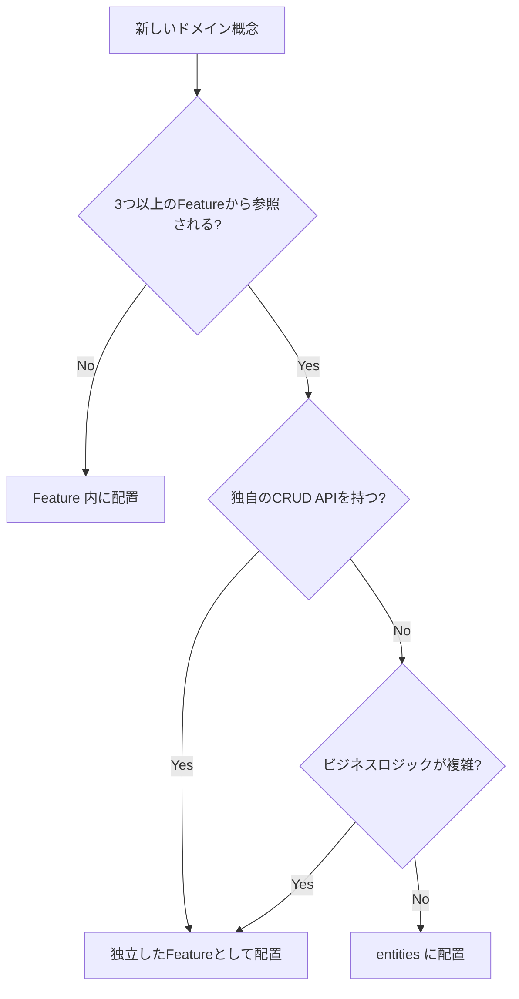

# ガイドラインレビュー結果

## 🎯 総合評価：★★★★★（5/5）

ガイドライン自体の**構造と内容は非常に優れています**。以下、開発者が迷いやすい箇所と改善提案をまとめます。

---

## ✅ 優れている点

### 1. **明確な構造と早見表**
- `overview.md` の「やりたいこと → 参照ガイド」マッピングが秀逸
- 開発者が迷わず適切なガイドに辿り着ける設計

### 2. **一貫したアーキテクチャ思想**
- Read/Write の明確な分離方針
- Feature-first 共置パターンの徹底
- 依存方向の明示（shared → features → app）

### 3. **具体的なコード例**
- `features.md` の Server Actions サンプルコードが実践的
- API レスポンス形式の統一パターンが明確

### 4. **段階的な詳細度**
- overview → 各ディレクトリガイドへの適切な情報粒度
- チェックリストで実装時の確認ポイントを提供

---

## 🤔 分かりにくい箇所・改善提案

### 1. **「内部API」の定義が曖昧（app-api.md）**

**問題箇所**: `app-api.md:4`
> **GET 専用**。読み取りデータを提供する内部 API。

**何が不明確か**:
- 「内部」とは？ 外部からアクセスできないのか、それとも認証があれば外部も可？
- 公開シフト表示（`/app/shifts`）は認証なしでアクセスできるが、それも「内部API」？

**改善提案**:
```markdown
## 方針
- **GET 専用**。読み取りデータを提供する API。
- **「内部」の定義**: サーバーコンポーネント、クライアントコンポーネントから呼ばれる前提。
  - 認証が必要なエンドポイントは `authenticateFromRequest()` でチェック
  - 公開エンドポイント（公開シフト表示など）も含む
  - 外部サービスからの直接呼び出しは想定しない（CORS未設定）
```

---

### 2. **Server Actions の「共置」の粒度が不明（features.md）**

**問題箇所**: `features.md:21`
> **Write（POST/PUT/PATCH/DELETE）**: **Server Actions** を `/features/<feature>/actions.ts` に共置

**何が不明確か**:
- 1機能に複数のServer Actionsがある場合、すべて1ファイル（`actions.ts`）に書く？
- それとも `actions/createTodo.ts`, `actions/deleteTodo.ts` のようにディレクトリ分割？
- 命名規則は？ `createTodoAction` vs `createTodo`？

**改善提案**:
```markdown
## Server Actions の配置ルール

### 基本: 1ファイルに集約
```
/features/todos/
  actions.ts  # すべてのWrite処理をここに（3-5個程度まで）
```

### 複雑な場合: ディレクトリ分割
```
/features/todos/
  /actions/
    create.ts   # createTodoAction
    update.ts   # updateTodoAction
    delete.ts   # deleteTodoAction
    index.ts    # 再エクスポート
```

### 命名規則
- 関数名: `<動詞><名詞>Action` 形式（例: `createTodoAction`, `updateShiftAction`）
- ファイル名: 動詞のみ（例: `create.ts`, `update.ts`）
```

---

### 3. **「Hydrate」の説明がない（overview.md, app.md）**

**問題箇所**: `overview.md:19`
> **`app/api` の GET** を用意 → **RSC で prefetch** → CSR で **`<Hydrate>`**（TanStack Query）

**何が不明確か**:
- `<Hydrate>` とは何？ TanStack Query の標準コンポーネント？
- どこに配置するのか？
- 実装例がない

**改善提案**:
`app.md` に以下を追加：
```markdown
## RSC Prefetch → Hydrate パターン

### 概要
1. **RSC（Server Component）**: サーバー側でデータを prefetch
2. **dehydrate**: prefetch したデータを直列化
3. **Hydrate**: クライアント側で QueryClient にデータを復元

### 実装例
```tsx
// app/(dashboard)/todos/page.tsx (RSC)
import { HydrationBoundary, dehydrate } from '@tanstack/react-query';
import { getQueryClient } from '@/shared/lib/queryClient';
import { prefetchTodos } from '@/features/todos/queries/prefetch';
import { TodoList } from '@/features/todos/components/TodoList';

export default async function TodosPage() {
  const queryClient = getQueryClient();
  await prefetchTodos(queryClient);

  return (
    <HydrationBoundary state={dehydrate(queryClient)}>
      <TodoList />  {/* Client Component */}
    </HydrationBoundary>
  );
}
```

```tsx
// features/todos/components/TodoList.tsx (CSC)
'use client';
import { useTodosQuery } from '../queries/useTodosQuery';

export function TodoList() {
  const { data } = useTodosQuery(); // キャッシュから即座に取得
  return <ul>{data.map(todo => <li key={todo.id}>{todo.title}</li>)}</ul>;
}
```

### 注意点
- `<HydrationBoundary>` は TanStack Query v5 の名称（v4では `<Hydrate>`）
- `getQueryClient()` はサーバー専用のシングルトンを返す（`shared/lib/queryClient`）
```

---

### 4. **`revalidatePath` vs `revalidateTag` の使い分けが不明（features.md）**

**問題箇所**: `features.md:37`
> 成功後は **`revalidatePath`/`revalidateTag`** で RSC を最新化

**何が不明確か**:
- どちらをいつ使うのか？
- 両方使うケースは？

**改善提案**:
`features.md` の Server Actions セクションに追加：
```markdown
## revalidatePath vs revalidateTag

### revalidatePath（推奨：シンプルなケース）
- **用途**: 特定のパスのキャッシュを無効化
- **例**: Todo作成後に `/todos` ページを再レンダリング

```ts
export async function createTodoAction(input: unknown) {
  // ...作成処理
  revalidatePath('/todos');  // /todos ページのみ更新
}
```

### revalidateTag（推奨：複雑な依存関係）
- **用途**: タグ付けされた複数のfetchリクエストを一括無効化
- **例**: Todo作成が複数ページに影響する場合

```ts
// app/api/todos/route.ts
export async function GET() {
  const data = await fetch('...', { next: { tags: ['todos'] } });
  // ...
}

// features/todos/actions.ts
export async function createTodoAction(input: unknown) {
  // ...作成処理
  revalidateTag('todos');  // 'todos' タグの全fetchを無効化
}
```

### 判断基準
- 1-2ページに影響 → `revalidatePath`
- 3+ページ or 複雑な依存 → `revalidateTag`
```

---

### 5. **entities と features の境界が曖昧（entities.md）**

**問題箇所**: `entities.md:11`
> 本当に横断的か？（Feature で閉じられないか見直す）

**何が不明確か**:
- 「横断的」の具体的な判断基準がない
- 例が一切ないので想像しにくい

**改善提案**:
```markdown
## entities vs features の判断フロー



## 配置例

### ✅ entities に配置すべきもの
- **User**: 認証、プロフィール、コメント、履歴で参照。独自のCRUD APIはない（auth featureで管理）
- **Tag**: 複数の機能で使用。単純な型定義と小UIのみ

### ❌ features に配置すべきもの
- **Instructor**: インストラクター管理機能で独自のCRUD。他機能からも参照されるが、中心的なドメイン
- **Shift**: シフト管理の中核。複雑なビジネスロジック

### 判断に迷ったら
→ まず **features** に配置。3つ目の参照箇所が出たら entities へ昇格を検討
```

---

### 6. **widgets の「I/Oは持たない」の解釈が曖昧（widgets.md）**

**問題箇所**: `widgets.md:7`
> I/O は持たず、上位（app/pages や features/pages）に委譲。

**何が不明確か**:
- 「I/O」とは？ データフェッチング全般？ それともイベントハンドラも？
- onClick ハンドラは Widget に持たせていい？

**改善提案**:
```markdown
## I/O 制限の詳細

### ❌ Widget で禁止
- データフェッチング（`useQuery`, `useMutation`, `fetch`）
- Server Actions の直接呼び出し
- グローバル状態の更新（context への書き込み）

### ✅ Widget で許可
- Props経由のイベントハンドラ（`onClick`, `onSubmit` など）
- ローカル状態（`useState` での開閉制御など）
- グローバル状態の**読み取り**のみ（context の参照）

### 実装例

```tsx
// ❌ 悪い例: Widget がデータ取得
export function DashboardCard() {
  const { data } = useShiftsQuery(); // Widget でデータ取得は禁止
  return <Card>{data.length} shifts</Card>;
}

// ✅ 良い例: データは Props で受け取る
export function DashboardCard({ shiftCount }: { shiftCount: number }) {
  return <Card>{shiftCount} shifts</Card>;
}

// 呼び出し側（app/page.tsx または features/pages）でデータ取得
export default function DashboardPage() {
  const { data } = useShiftsQuery();
  return <DashboardCard shiftCount={data.length} />;
}
```
```

---

### 7. **test.md の「Feature 近接」の具体的な配置場所が不明**

**問題箇所**: `test.md:8`
> `__tests__` は **Feature 近接**、/test は**基盤**。

**何が不明確か**:
- 「近接」とは Feature ディレクトリの直下？ それとも components の隣？
- ファイル名の命名規則は？

**改善提案**:
```markdown
## テスト配置ルール

### Unit/Integration テスト
- **配置場所**: テスト対象と同階層の `__tests__` ディレクトリ
- **命名規則**: `<対象ファイル名>.test.ts(x)`

```
/features/todos/
  /components/
    TodoList.tsx
    __tests__/
      TodoList.test.tsx       # TodoList のテスト
  /queries/
    useTodosQuery.ts
    __tests__/
      useTodosQuery.test.ts   # Query のテスト
  /actions.ts
  __tests__/
    actions.test.ts           # Server Actions のテスト（MSWでモック）
```

### E2Eテスト
- **配置場所**: プロジェクトルートの `/e2e` または `/tests/e2e`
- **命名規則**: `<フロー名>.spec.ts`

```
/e2e/
  auth.spec.ts      # 認証フロー
  shift-crud.spec.ts  # シフトCRUD
```

### Storybook
- **配置場所**: コンポーネントと同階層
- **命名規則**: `<コンポーネント名>.stories.tsx`

```
/features/todos/components/
  TodoList.tsx
  TodoList.stories.tsx
```
```

---

### 8. **overview.md の「データ取得の意思決定」に例外ケースの説明不足**

**問題箇所**: `overview.md:22`
> 4) **URLで受ける必要があるもの（Webhook/OAuth callback 等）** → 例外的に **`app/api`** を使用。

**何が不明確か**:
- この例外ケースでも GET 専用なのか、POST も許可されるのか？
- Webhook は POST が一般的だが、それは許可される？

**改善提案**:
```markdown
## データ取得の意思決定（超要約）
1) **読み取り（GET）** → **`app/api` の GET** を用意 → **RSC で prefetch** → CSR で **`<Hydrate>`**（TanStack Query）。
2) **更新（POST/PUT/PATCH/DELETE）** → **Server Actions** を実装（zod 検証 + `revalidatePath`/`revalidateTag`）。
3) **頻繁更新/リアルタイム** → **CSR + Query**（`refetchInterval` / WS など）。
4) **外部からURLで呼ばれるもの（例外）** → **`app/api` に POST/PUT 等を実装**。

### 例外ケース（外部URL必須）の詳細
以下のケースは外部サービスがURLを呼び出すため、API Route が必須です：

| ケース | メソッド | 配置例 | 備考 |
|--------|----------|--------|------|
| Webhook | POST | `/app/api/webhooks/stripe/route.ts` | 外部サービスからのコールバック |
| OAuth callback | GET/POST | `/app/api/auth/line/callback/route.ts` | 認証プロバイダーからのリダイレクト |
| 外部API公開 | GET/POST | `/app/api/public/stats/route.ts` | 外部連携用エンドポイント |

**原則**: これらの例外以外は Server Actions を使用
```

---

### 9. **「queryKey の集中管理」の実装パターンが不明確（features.md）**

**問題箇所**: `features.md:23`
> `keys.ts` に `queryKey` を集中（`as const`）。

**何が不明確か**:
- 階層的なキー設計のパターンが示されていない
- フィルタがある場合の設計例がない

**改善提案**:
```markdown
## queryKey の設計パターン

### 基本構造
TanStack Query の公式推奨に従い、階層的に設計します。

```ts
// features/todos/queries/keys.ts
export const todoKeys = {
  all: ['todos'] as const,                              // ['todos']
  lists: () => [...todoKeys.all, 'list'] as const,      // ['todos', 'list']
  list: (filters: string) => [...todoKeys.lists(), { filters }] as const, // ['todos', 'list', { filters }]
  details: () => [...todoKeys.all, 'detail'] as const,  // ['todos', 'detail']
  detail: (id: number) => [...todoKeys.details(), id] as const, // ['todos', 'detail', 1]
};
```

### 無効化の粒度
```ts
// すべての todos 関連を無効化
queryClient.invalidateQueries({ queryKey: todoKeys.all });

// リストのみ無効化（詳細は残る）
queryClient.invalidateQueries({ queryKey: todoKeys.lists() });

// 特定フィルタのリストのみ無効化
queryClient.invalidateQueries({ queryKey: todoKeys.list('active') });
```

### 複数パラメータがある場合
```ts
export const shiftKeys = {
  all: ['shifts'] as const,
  lists: () => [...shiftKeys.all, 'list'] as const,
  list: (params: { departmentId?: number; dateFrom?: string; dateTo?: string }) =>
    [...shiftKeys.lists(), params] as const,
};
```
```

---

### 10. **アンチパターンの説明が概要のみ（overview.md:81）**

**問題箇所**: `overview.md:81`
> アンチパターン: UI からの直 `fetch`、`queryKey` 直書き、境界違反、Story/Tests の分離。

**何が不明確か**:
- なぜアンチパターンなのか理由がない
- 「境界違反」が何を指すのか不明

**改善提案**:
新規ファイル `docs/guideline/anti-patterns.md` を作成：

```markdown
# アンチパターン集

## 1. ❌ UI から直接 fetch
```tsx
// 悪い例
export function TodoList() {
  const [todos, setTodos] = useState([]);
  useEffect(() => {
    fetch('/api/todos').then(r => r.json()).then(setTodos);
  }, []);
  return <ul>{todos.map(...)}</ul>;
}
```

**問題点**:
- キャッシュが効かない（毎回通信）
- ローディング・エラー状態の管理が煩雑
- 型安全性がない

**正しい実装**: TanStack Query 経由
```tsx
export function TodoList() {
  const { data, isLoading, error } = useTodosQuery();
  if (isLoading) return <Loading />;
  if (error) return <Error />;
  return <ul>{data.map(...)}</ul>;
}
```

## 2. ❌ queryKey の直書き
```tsx
// 悪い例
useQuery({ queryKey: ['todos', 'list'], queryFn: fetchTodos });
```

**問題点**:
- typo のリスク
- 無効化時にキーの不一致でバグ

**正しい実装**: keys.ts で集中管理
```tsx
useQuery({ queryKey: todoKeys.list(), queryFn: fetchTodos });
```

## 3. ❌ 境界違反（依存の逆流）
```tsx
// 悪い例: shared が features に依存
// shared/components/Header.tsx
import { useAuth } from '@/features/auth/queries'; // NG!
```

**問題点**:
- 循環依存のリスク
- shared の再利用性が損なわれる

**依存方向**: `app → features → entities → shared → ライブラリ`

## 4. ❌ Story/Tests をコンポーネントから分離
```
// 悪い例
/features/todos/components/
  TodoList.tsx
/features/todos/stories/
  TodoList.stories.tsx    # 離れている
/__tests__/features/todos/
  TodoList.test.tsx       # 離れている
```

**問題点**:
- コンポーネント移動時に Story/Tests を忘れる
- ファイル間の移動が面倒

**正しい配置**: コロケーション（近接配置）
```
/features/todos/components/
  TodoList.tsx
  TodoList.stories.tsx    # 同階層
  __tests__/
    TodoList.test.tsx     # 近接
```
```

---

## 📋 優先度別改善リスト

### 🔴 優先度：高（開発者が頻繁に迷う箇所）
1. ✅ Server Actions の配置・命名規則（features.md）
2. ✅ `<Hydrate>` パターンの実装例（app.md）
3. ✅ `revalidatePath` vs `revalidateTag`（features.md）
4. ✅ entities vs features の判断基準（entities.md）

### 🟡 優先度：中（明確化すると便利）
5. ✅ widgets の I/O 制限の詳細（widgets.md）
6. ✅ テスト配置ルール（test.md）
7. ✅ queryKey 設計パターン（features.md）
8. ✅ 例外ケース（Webhook等）の説明（overview.md）

### 🟢 優先度：低（あると完璧）
9. ✅ アンチパターン集の独立化
10. ✅ 「内部API」の定義明確化（app-api.md）

---

## ✨ 結論

現状のガイドラインは**骨格は非常に優秀**です。上記の具体例・判断基準を補強することで、**開発者が迷わず実装できる完璧なドキュメント**になります。

特に優先度：高（1-4）の改善を実施することで、以下の効果が期待できます：

1. **実装の一貫性向上**: 開発者間での実装方法のばらつきを最小化
2. **オンボーディング時間短縮**: 新規参加者が迷わず実装を開始できる
3. **レビューコスト削減**: ガイドライン準拠の確認が容易になる
4. **保守性向上**: Feature-first + Server Actions により変更の影響範囲が局所化される

Feature-first + Server Actions の方針は、Next.js App Router の best practice に合致しており、長期的な保守性を大きく向上させるでしょう。
